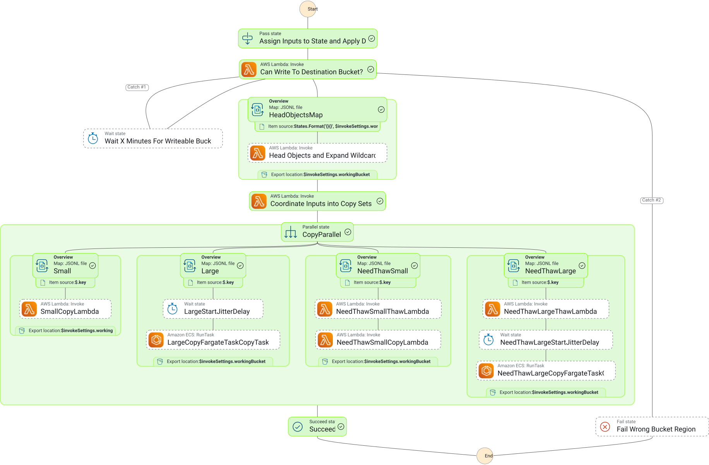

# Development

On check-out (once only) (note that `pre-commit` is presumed installed externally e.g. by `brew`, `apt` etc)

```shell
pre-commit install
```

For package installation (note that `bun` is presumed installed externally)

```shell
bun install
```

Edit the packages and deploy to dev

```shell
bun run dev-deploy
```

The dev stack looks up an existing VPC by name. By default it uses `main-vpc`. To deploy into a
different VPC, pass the `vpcName` context:

```shell
bun run dev-deploy -c vpcName=my-vpc
```

To remove entirely

```shell
bun run dev-destroy
```

A single install in this repo will install all dependencies across packages, as the structure is set-up as a
bun workspace. This also means that the consumer's lockfile is used for the steps-s3-copy package when bundling,
but this shouldn't be an issue and is expected behaviour for a CDK consumer.

## Graph



## Testing

See [README](./dev-testsuite/README.md).

## Release

After development and testing of the construct - a package of it can be released to
the `npm` registry with a defined release version.

This is performed in GitHub by creating a release and specifying an appropriate tag (following
basic semantic versioning rules).

## Learnings (out of date)

Some learnings from actual copies.

Switch off AWS Config continuous for SecurityGroup and NetworkInterface.

Items per batch of 100 - caused problems with the filenames occupying too much space in the environment passed into the Task.

Concurrency of 80 caused issues with Throttling and Capacity - putting more sensible Retry policies on RunTask seems to
have fixed the Throttling. We were still seeing capacity issues.

The final copy needed to have a concurrency down to 25 to safely not have any issues.

Creating S3 checksums using S3 Batch (Copy) (as recommended by AWS) does not work for any
objects greater than 5GiB (5368709120). This is the upper limit of the CopyObject
call that is made by S3 Batch.

S3 objects can be constructed with inconsistent part sizes when making a
Multipart Upload.

GetObjectAttributes is the only way to retrieve details about multi part uploads - but
it does not return any details if the objects are not created with "new" checksums.
Objects created with just ETags do not return the parts as an array.

Task definition size Each supported Region: 64 Kilobytes No The maximum size, in KiB, of a task definition. The task definition
accepts the command line arguments when the copier is launched (or values passed in via environment variables) - so sets the
maximum launch size (unless we were to pivot to other services like dynamo)

These names are the object keys. The name for a key is a sequence of Unicode characters whose UTF-8 encoding is at most 1024 bytes long.
The following are some of the rules: The bucket name can be between 3 and 63 characters long, and
can contain only lower-case characters, numbers, periods, and dashes. Each label in the bucket name must start with a lowercase letter or number.
